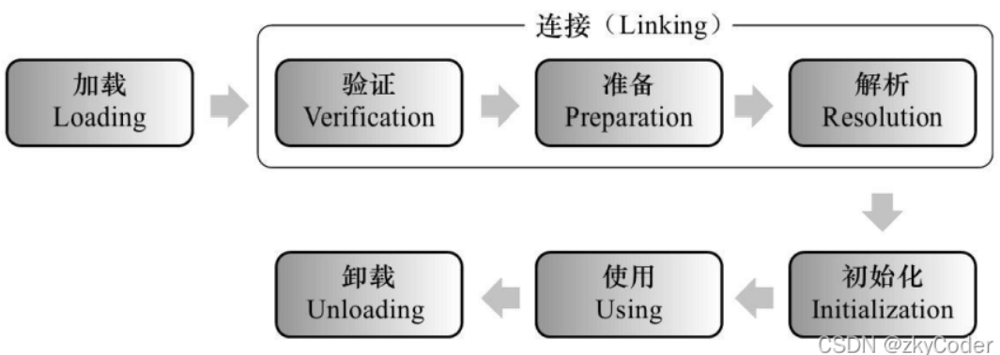

# statement

```java
//1.注册驱动
/*
*
* TODO:
*  依赖：驱动版本 8+ com.mysql.cj.jdbc.Driver
*       驱动版本 5+ com.mysql.jdbc.Driver
*
*
*
* */
DriverManager.registerDriver(new Driver());
//2.获取连接
/*
* TODO:
*  java程序，连接数据库，肯定是调用某个方法，方法要填入连接数据库的基本信息
*       数据库ip地址 127.0.0.1
*       数据库端口号 3306
*       账号 root
*       密码
*       连接数据库的名称：atguigu
*
* */
Connection connect = DriverManager.getConnection("jdbc:mysql://127.0.0.1:3306/atguigu","root","085595");
//3.创建statement
Statement statement = connect.createStatement();
//4.发送sql语句，并且获取返回结果
String sql = "select * from t_user;";
ResultSet resultSet = statement.executeQuery(sql);
//5.进行结果集解析
while(resultSet.next()){
    int id = resultSet.getInt("id");
    String account = resultSet.getString("account");
    String password = resultSet.getString("password");
    String nickname = resultSet.getString("nickname");
    System.out.println(id+"--"+account+"--"+password+"--"+nickname);
}
//6.关闭连接
resultSet.close();
statement.close();
connect.close();
```


类加载机制——jvm编译过程

加载[class文件 -> jvm虚拟机的class对象]、连接[验证（检查文件类型） ->  准备（静态变量默认值） -> 解析（触发静态代码块）]、初始化[静态属性赋真实值]。



```java
//1.注册驱动
/*
* 方案1：DriverManager.registerDriver(new com.mysql.cj.jdbc.Driver());
*   问题：注册两次驱动
*       1.DriverManager.registerDriver()方法本身会注册一次
*       2.Driver.static{DriverManager.registerDriver()}静态代码块也会注册一次
*   解决：只想注册一次驱动
*       只触发静态代码块即可！Driver
*   触发静态代码块：
*       类加载机制：类加载的时刻，会触发静态代码块！
*               加载、连接、初始化
*   触发类加载：
*       1.new关键字
*       2.调用静态方法
*       3.调用静态属性
*       4.接口 default默认实现
*       5.反射
*       6.子类触发父类
*       7.程序的入口main
*
*
* */
//DriverManager.registerDriver(new Driver());
//new Driver();
Class.forName("com.mysql.cj.jdbc.Driver");
```

